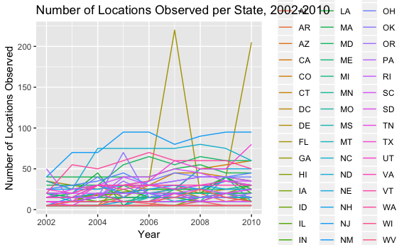
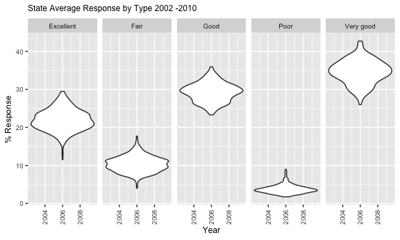
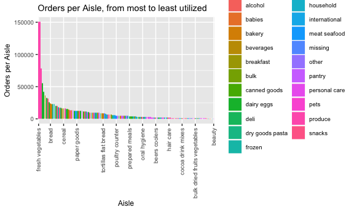

P8105 HW 3 MSG2194
================
Saray Gonzalez

``` r
knitr::opts_chunk$set(
  fig.width = 6,
  fig.asp = .6,
  out.width = "90%"
)

library(tidyverse)
```

    ## ── Attaching packages ────────────────────────────────────────── tidyverse 1.2.1 ──

    ## ✔ ggplot2 3.0.0     ✔ purrr   0.2.5
    ## ✔ tibble  1.4.2     ✔ dplyr   0.7.6
    ## ✔ tidyr   0.8.1     ✔ stringr 1.3.1
    ## ✔ readr   1.1.1     ✔ forcats 0.3.0

    ## ── Conflicts ───────────────────────────────────────────── tidyverse_conflicts() ──
    ## ✖ dplyr::filter() masks stats::filter()
    ## ✖ dplyr::lag()    masks stats::lag()

``` r
library(ggridges)
```

    ## 
    ## Attaching package: 'ggridges'

    ## The following object is masked from 'package:ggplot2':
    ## 
    ##     scale_discrete_manual

``` r
library(patchwork)
```

Problem 1
=========

Load data

``` r
library(p8105.datasets)
data("brfss_smart2010") %>% 
  janitor::clean_names() 
```

    ##              <NA> 
    ## "brfss_smart2010"

``` r
brfss_smart2010 %>% 
  filter(Topic == "Overall Health") %>% 
  distinct(Response) %>% 
  mutate(Response = factor(Response, levels = c("Excellent", "Very good", 
                                                "Good", "Fair", "Poor"))) %>%
  arrange(Response)
```

    ## # A tibble: 5 x 1
    ##   Response 
    ##   <fct>    
    ## 1 Excellent
    ## 2 Very good
    ## 3 Good     
    ## 4 Fair     
    ## 5 Poor

### In 2002, which states were observed at 7 locations?

This questions deals with the variables: Year, Locationabbr, possibly LocationID, and possily GeoLocation, LocationDesc or LocationID. Of all location specific variables, LocationDesc seems the most appropriate. The code below yields a viewable table where the states of CT, FL and NC appear in 7 locations of observation.

``` r
brfss_smart2010 %>%  
  filter(Topic == "Overall Health", Year == 2002) %>% 
  group_by(Locationabbr, Locationdesc) %>% 
  summarize(n = n()) %>% 
  count(Locationabbr) %>% View
```

### Make a “spaghetti plot” that shows the number of locations in each state from 2002 to 2010.

Here we are interested in plotting year on the x axis, y is the number of locations observed per stated, which equates to the counties. Since the variable ", and "locationdesc" is a composite of both state and county, it is best to first separate this variable into its components, so tha we can county the total number of counties within the subset of each state, rather than counting the number of observations per state and county. We'll do this by using the 'group\_by' + 'summarize' functions and then plot using the line geometry. The states will be in different colors and will all be graphed stacked against the same axis (x = year and y = number of locations).

``` r
brfss_smart2010 %>%  
  filter(Topic == "Overall Health") %>% 
  separate(Locationdesc, into = c("st", "cty"), sep = "-") %>% 
  group_by(Year, st) %>% 
  summarize(n_cty = n()) %>% 
  ggplot(aes(x = Year, y = n_cty, color = st)) +
    geom_line() +
    labs(
      title = "Number of Locations Observed per State, 2002-2010",
      y = "Number of Locations Observed"
    ) +
    theme(legend.background = element_rect(size = 0.5))
```

    ## Warning: Expected 2 pieces. Additional pieces discarded in 40 rows [311,
    ## 312, 313, 314, 315, 1713, 1714, 1715, 1716, 1717, 3136, 3137, 3138, 3139,
    ## 3140, 4577, 4578, 4579, 4580, 4581, ...].

 \#\#\# Make a table showing, for the years 2002, 2006, and 2010, the mean and standard deviation of the proportion of “Excellent” responses across locations in NY State.

Applied filters to Topic, Year, Response and Locationabbr first. Then used the function combination 'group\_by' + 'Summarize' to calculate the requested summary statistics of central tendency. Finally, the results were exported using the 'knitr::kable' function

``` r
brfss_smart2010 %>% 
  filter(Topic == "Overall Health") %>% 
  filter(Year %in% c("2002", "2006", "2010")) %>% 
  filter(Response == "Excellent") %>% 
  filter(Locationabbr == "NY") %>% 
  group_by(Year, Response, Locationabbr) %>% 
  summarize(mean_excellent = mean(Data_value), sd_excellent = sd(Data_value)) %>% 
  knitr::kable(digits = 1)
```

|    Year| Response    | Locationabbr    |    mean\_excellent|                                                                                                                                                                                                                 sd\_excellent|
|-------:|:------------|:----------------|------------------:|-----------------------------------------------------------------------------------------------------------------------------------------------------------------------------------------------------------------------------:|
|    2002| Excellent   | NY              |               24.0|                                                                                                                                                                                                                           4.5|
|    2006| Excellent   | NY              |               22.5|                                                                                                                                                                                                                           4.0|
|    2010| Excellent   | NY              |               22.7|                                                                                                                                                                                                                           3.6|
|  \#\#\#| For each ye | ar and state, c |  ompute the averag|  e proportion in each response category (taking the average across locations in a state). Make a five-panel plot that shows, for each response category separately, the distribution of these state-level averages over time.|

Raw data was manipulated as specified throughout this problem. Then, using the 'group\_by' + 'summarize' function combination, the average response was calculated and then plotted using 'ggplot'.

``` r
brfss_smart2010 %>% 
  filter(Topic == "Overall Health") %>% 
  group_by(Year, Locationabbr, Response) %>% 
  summarize(average_response = mean(Data_value)) %>% 
  ggplot(aes(x = Year, y = average_response)) +
  facet_grid(. ~ Response) +
  geom_violin() +
  labs(
    title = "State Average Response by Type 2002 -2010", y = "% Response"
  ) + 
  theme(axis.text.x = element_text(angle = 90, vjust = 0.5, hjust = 1), text = element_text(size = 9)) +
  theme(plot.title = element_text(size = 9))
```

    ## Warning: Removed 21 rows containing non-finite values (stat_ydensity).



Problem 2
=========

Load data

``` r
library(p8105.datasets)
data("instacart") %>% 
  janitor::clean_names()
```

    ##        <NA> 
    ## "instacart"

Look at the data This dataset includes 15 variables and 1.38 million observations. This dataset seems to include orders, but the smallest unit of data is the items ordered in the orders. Therefore unique orders will be repeated according to the items within them. The data seem tidy, since each item is listed seperately, regardless of the order it was purchased with. To view the dataset, I used the 'names' function, called the data set within this R Markdown and used the 'View' function on the R console (not shown on this Markdown document).

``` r
names(instacart)
```

    ##  [1] "order_id"               "product_id"            
    ##  [3] "add_to_cart_order"      "reordered"             
    ##  [5] "user_id"                "eval_set"              
    ##  [7] "order_number"           "order_dow"             
    ##  [9] "order_hour_of_day"      "days_since_prior_order"
    ## [11] "product_name"           "aisle_id"              
    ## [13] "department_id"          "aisle"                 
    ## [15] "department"

``` r
instacart
```

    ## # A tibble: 1,384,617 x 15
    ##    order_id product_id add_to_cart_ord… reordered user_id eval_set
    ##       <int>      <int>            <int>     <int>   <int> <chr>   
    ##  1        1      49302                1         1  112108 train   
    ##  2        1      11109                2         1  112108 train   
    ##  3        1      10246                3         0  112108 train   
    ##  4        1      49683                4         0  112108 train   
    ##  5        1      43633                5         1  112108 train   
    ##  6        1      13176                6         0  112108 train   
    ##  7        1      47209                7         0  112108 train   
    ##  8        1      22035                8         1  112108 train   
    ##  9       36      39612                1         0   79431 train   
    ## 10       36      19660                2         1   79431 train   
    ## # ... with 1,384,607 more rows, and 9 more variables: order_number <int>,
    ## #   order_dow <int>, order_hour_of_day <int>,
    ## #   days_since_prior_order <int>, product_name <chr>, aisle_id <int>,
    ## #   department_id <int>, aisle <chr>, department <chr>

### How many aisles are there, and which aisles are the most items ordered from?

There are a total of 134 distinct aisles. The 'count' function was used to count the number of distinct aisle id.

``` r
instacart %>% 
  count(n_distinct(aisle_id))
```

    ## # A tibble: 1 x 2
    ##   `n_distinct(aisle_id)`       n
    ##                    <int>   <int>
    ## 1                    134 1384617

By using the 'group\_by' + 'summarize' function combination, the total number of orders was calculated for each aisle to yield a tibble that lists the aisles most ordered from in desceing order. The aisles most ordered from are fresh vegetables, fresh fruits and packaged vegetables and fruits.

``` r
instacart %>% 
  group_by(aisle, order_id) %>% 
  summarize(total_count = n()) %>% 
  group_by(aisle) %>% 
  summarize(total_order = sum(total_count)) %>% 
  arrange(desc(total_order))
```

    ## # A tibble: 134 x 2
    ##    aisle                         total_order
    ##    <chr>                               <int>
    ##  1 fresh vegetables                   150609
    ##  2 fresh fruits                       150473
    ##  3 packaged vegetables fruits          78493
    ##  4 yogurt                              55240
    ##  5 packaged cheese                     41699
    ##  6 water seltzer sparkling water       36617
    ##  7 milk                                32644
    ##  8 chips pretzels                      31269
    ##  9 soy lactosefree                     26240
    ## 10 bread                               23635
    ## # ... with 124 more rows

### Make a plot that shows the number of items ordered in each aisle. Order aisles sensibly, and organize your plot so others can read it.

Again, using the 'group\_by' + 'summarize' function combination, the most number of orders per aisle was computed and then plotted with a histogram geometry. The aisles on the x axis were ordered from the most number orders to the least number of orders, from left to right. To make it more appealing, the departments to which the aisles belong to dictated the color fill for the aisle histogram bars.

``` r
instacart %>% 
  group_by(aisle, aisle_id, department) %>% 
  summarize(orders_per_aisle = n()) %>% 
  arrange(desc(orders_per_aisle)) %>% 
  ggplot(aes(fct_reorder(aisle, desc(orders_per_aisle)), orders_per_aisle, fill = department)) +
  geom_bar(stat = "identity") +
  theme(axis.text.x = element_text(angle = 90, vjust = 0.5, hjust = 1), text = element_text(size = 9))+
  labs(title = "Orders per Aisle, from most to least utilized",
       y = "Orders per Aisle") +
  scale_x_discrete("Aisle", breaks = c("fresh vegetables", "bread", "cereal", "paper goods", "cookie cakes", "tortillas flat bread", "poultry counter", "prepared meals", "oral hygiene", "beers coolers", "hair care", "cocoa drink mixes", "bulk dried fruits vegetables", "beauty")) +
  theme(legend.background = element_rect(size = 0.5))
```

 \#\#\# Make a table showing the most popular item in each of the aisles “baking ingredients”, “dog food care”, and “packaged vegetables fruits”.

The aisle variable was filtered first, and then the 'group\_by' + 'summarize' function combination was used to calculate the number of products ordered per each of the three aisles of interest. The resulting dataframe was further filtered to only yield the maximum values of this calculation. Finally, the 'knitr::kable' function was used to export the final result onto a table. The most popular products within each of the three aisles are light broan sugar in the baking ingredients aisle, snack sticks chicken and rice recipe treats in the dog food care aisle and organic baby spinach in the packaged vegetables fruits aisle.

``` r
instacart %>% 
  filter(aisle %in% c("baking ingredients", "dog food care", "packaged vegetables fruits")) %>% 
  group_by(aisle, product_name) %>% 
  summarize(total_product = n()) %>% 
  filter(total_product == max(total_product)) %>% 
  knitr::kable(digits = 1)
```

| aisle                      | product\_name                                 |  total\_product|
|:---------------------------|:----------------------------------------------|---------------:|
| baking ingredients         | Light Brown Sugar                             |             499|
| dog food care              | Snack Sticks Chicken & Rice Recipe Dog Treats |              30|
| packaged vegetables fruits | Organic Baby Spinach                          |            9784|

### Make a table showing the mean hour of the day at which Pink Lady Apples and Coffee Ice Cream are ordered on each day of the week; format this table for human readers (i.e. produce a 2 x 7 table).

A filter was first applied to the product name variable to call only the two products of interest. Using the 'group\_by' + 'summarize' function combination, the mean hour of the day was calculated. The 'spread' function was used to untidy the data in a more readable format, so that the day of the week spread horizontally and the mean hour of the day is tabulated vertically accross each day of the week for both products of interest. Finally, the 'knitr::kable' function is used to export the resulting table, with 2 rows and 7 columns.

``` r
instacart %>% 
  filter(product_name %in% c("Pink Lady Apples","Coffee Ice Cream")) %>% 
  group_by(order_dow, product_name) %>%
  summarise(mean_hour = mean(order_hour_of_day)) %>% 
  spread(key = order_dow, value = mean_hour) %>% 
  knitr::kable(digits = 1)
```

| product\_name    |     0|     1|     2|     3|     4|     5|     6|
|:-----------------|-----:|-----:|-----:|-----:|-----:|-----:|-----:|
| Coffee Ice Cream |  13.8|  14.3|  15.4|  15.3|  15.2|  12.3|  13.8|
| Pink Lady Apples |  13.4|  11.4|  11.7|  14.2|  11.6|  12.8|  11.9|
